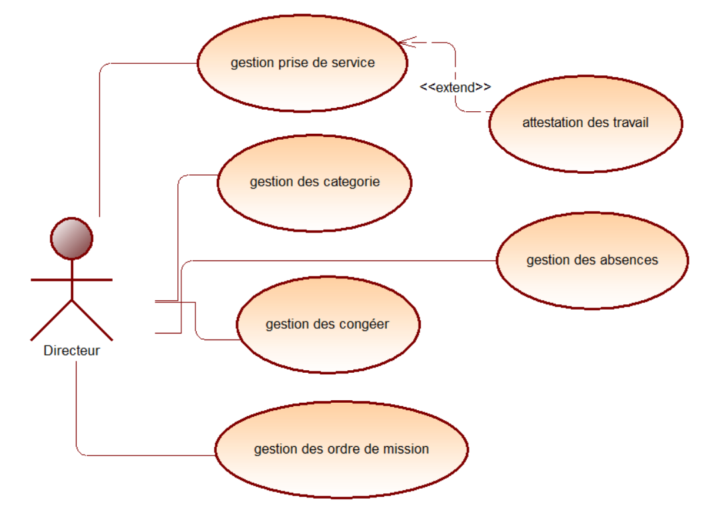
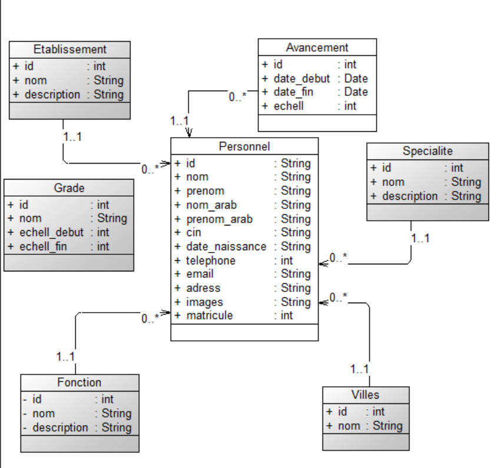
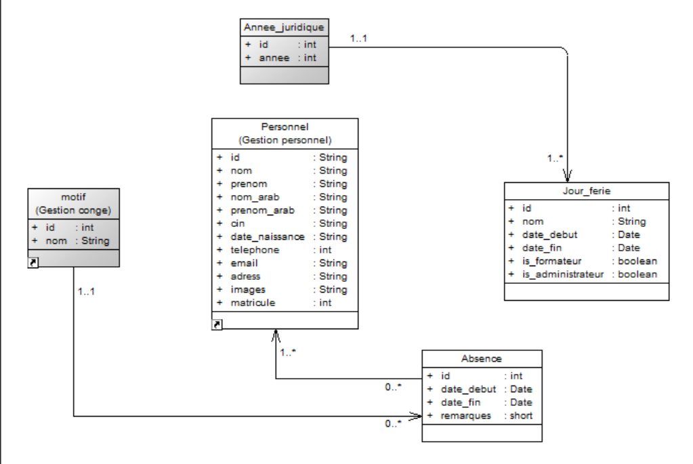
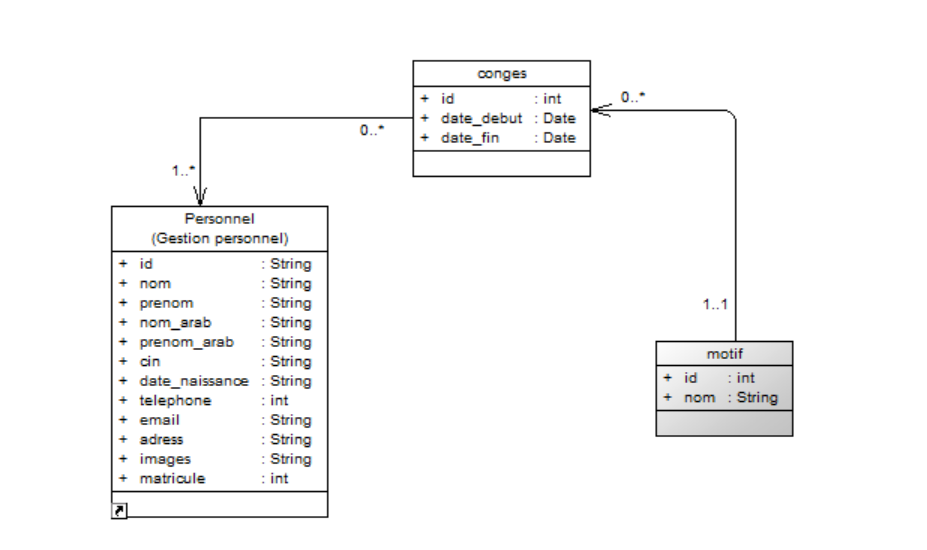
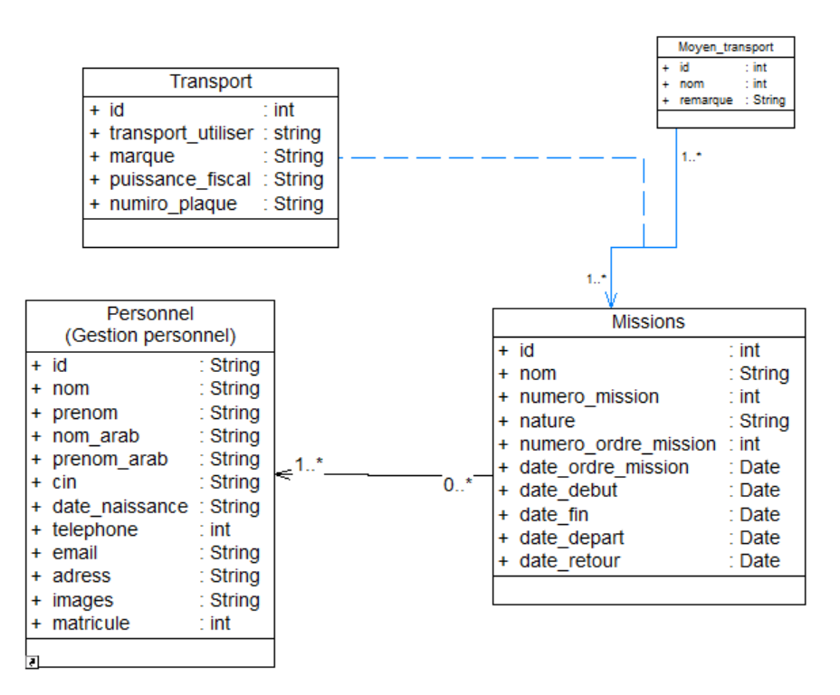

# Projets - Examen de fin de module

## Projet 0 : Gestion des tâches

### Diagramme de cas d'utilisation
### Diagramme de classe

## Projet 1 : CNMH

### Diagramme de cas d'utilisation
### Diagramme de classe

## Projet 2 : Soli-LMS

### Diagramme de cas d'utilisation
### Diagramme de classe

## Projet 3 : Gestion du personnel

### Diagramme de cas d'utilisation

### Diagramme de classe

- Package Pris-de-service

- Package Absence

- Package Conge

- Package Order-de-mission

